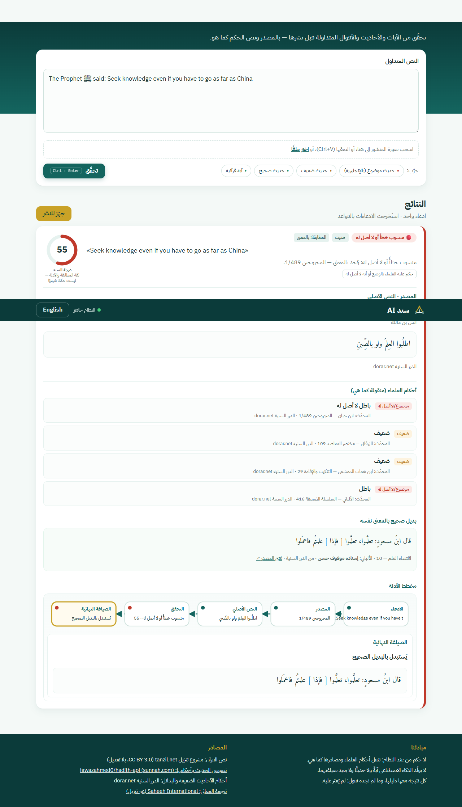
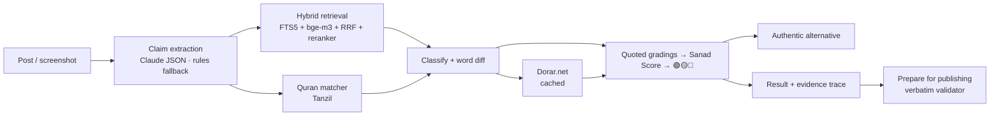

<div dir="rtl">

# سند AI — تحقّق قبل أن تنشر

**سند AI** أداة للدعاة وصنّاع المحتوى الإسلامي: الصق منشورًا متداولًا (أو صورة له) بالعربية أو الإنجليزية، فيستخرج
النظام كل آية وحديث وقول منسوب، ويجد **النص العربي الأصلي** في مصادر موثوقة، ويقارن الألفاظ (مطابق / جزء / مُغيَّر /
بالمعنى / لم يُعثر عليه)، وينقل **أحكام العلماء كما هي** بمصادرها، ويقترح **بديلًا صحيحًا** للضعيف والموضوع، ثم يجهّز
المنشور للنشر بالنصوص الأصلية حرفيًا مع التوثيق.

> **لا حكم من عند النظام.** لا يولّد الذكاء الاصطناعي آيةً ولا حديثًا ولا حكمًا؛ كل نص وكل حكم منقول من بيانات لها مصدر.
> وما لم نجده نقول عنه: «لم يُعثر عليه في المصادر المعتمدة».

مشاركة فردية في **تحدي الذكاء الاصطناعي في خدمة المحتوى الإسلامي** — مسار «أدوات المعرفة والتحقق لتمكين المعرّفين بالإسلام».

</div>

---

# SanadAI — verify before you share

**SanadAI** helps da'is and Islamic content creators check circulating posts. Paste a post (or drop a screenshot) in
Arabic or English; SanadAI extracts every Quran verse, hadith and attributed saying, retrieves the **original Arabic
source** from a trusted local corpus and Dorar.net, classifies how the circulating wording matches it, **quotes the
scholars' gradings verbatim** with their provenance, suggests an **authentic alternative** for weak or fabricated
texts, and rewrites the post with every sacred text replaced by its **verbatim original and citation**.



## What it does

- **Claim extraction** — Claude (structured JSON) or a rule-based fallback; extracted spans must exist verbatim in the post.
- **Quran matching** — exact match over the whole Mushaf (single verses, ranges, excerpts; imlaʾi or Uthmani spelling),
  altered-word detection with a word-level diff, translations matched by meaning. Display text: Tanzil Uthmani, verbatim.
- **Hadith retrieval** — 50,703 hadith from 17 collections (Arabic + English): FTS5 BM25 + bge-m3 vectors, Reciprocal
  Rank Fusion, bge-reranker-v2-m3.
- **Gradings, quoted** — 82k gradings by named graders (al-Albani, Shu'ayb al-Arna'ut, Zubair Ali Zai, Ahmad Shakir…)
  plus Dorar.net verdicts for weak/fabricated texts, each with book and number.
- **Traffic light + Sanad Score** — deterministic; a *match & evidence confidence*, not a religious ruling.
- **Evidence graph** — Claim → Source → Original → Verification → Final wording, with a timed trace of every step.
- **«جهّز للنشر» Prepare for publishing** — AR/EN, citations, WhatsApp share; a validator checks that every inserted
  sacred text exists verbatim in the sources.

Screenshot input (Gemini/Claude OCR) — a synthetic post image ([docs/demo/synthetic_post.png](docs/demo/synthetic_post.png))
is transcribed, its two claims extracted verbatim and verified (fabricated hadith 🔴, Quran 112:1 🟢).

## Quick start (4 commands)

Windows (PowerShell):

```powershell
git clone https://github.com/githubsud/sanadai.git; cd sanadai
.\scripts\setup.ps1        # venv + dependencies + .env
.\scripts\build_all.ps1    # datasets → SQLite → int8 models → vector index (demo subset) → Dorar cache
.\scripts\run.ps1          # http://127.0.0.1:8000  (API docs: /docs)
```

macOS / Linux:

```bash
git clone https://github.com/githubsud/sanadai.git && cd sanadai
./scripts/setup.sh && ./scripts/build_all.sh && ./scripts/run.sh
```

- Needs Python 3.11+ and ~5 GB of disk. `build_all` downloads ~90 MB of data and ~1.2 GB of models; building the demo
  vector index takes ~1–2 h on a laptop CPU (minutes on a GPU). The app works **before** the index exists (lexical
  search only) — you can run it as soon as `build_db` finishes.
- Optional: put `ANTHROPIC_API_KEY` **or** `GEMINI_API_KEY` in `.env` for LLM claim extraction and screenshot OCR
  (`LLM_PROVIDER=auto|anthropic|gemini`). Without a key, rule-based extraction is used and image input is disabled.
- The Dorar.net cache used by the demo is committed (`data/seeds/dorar_cache.jsonl`) and loaded by `build_db`, so the
  fresh clone works offline; `seed_dorar.py` refreshes it from the network.
- `make test` / `pytest -q` — 179 tests (2 model-based ones run with `RUN_SLOW=1`); `python scripts/run_eval.py` — evaluation (see below).

## Deploy online

| Option | Cost | What runs |
|---|---|---|
| **Render (free)** — `render.yaml` blueprint | free (512 MB, sleeps after 15 min idle) | *Lite*: lexical search (SQLite FTS5) + Gemini extraction/OCR + Dorar cache; no neural retrieval models (`requirements-lite.txt`, ~90 MB RAM) |
| **Docker** — `Dockerfile` (Hugging Face Spaces, any VM) | HF Docker Spaces need PRO | Full app incl. bge-m3 + reranker; data from `huggingfacesud/sanadai-data` |

Render: dashboard → **New → Blueprint** → select this repository → enter `GEMINI_API_KEY` when asked → Apply.
Public limits (per visitor): 60 verifications/hour, 20 AI calls/hour, 500 AI calls/day overall; beyond them the
rule-based extractor is used.

## Architecture



Details: [docs/ARCHITECTURE.md](docs/ARCHITECTURE.md). Stack: FastAPI · Pydantic v2 · SQLite/FTS5 · ChromaDB ·
bge-m3 / bge-reranker-v2-m3 (int8 ONNX on CPU) · Anthropic API · vanilla JS.

## Evaluation

120-item test set built deterministically from the sources (authentic, weak/fabricated, Quran, no-basis probes).
Full report: [docs/EVALUATION.md](docs/EVALUATION.md).

| Metric (120 items, 50,703-hadith corpus, CPU laptop, rule-based extraction, Dorar offline cache) | Result |
|---|---|
| Top-5 source accuracy (target ≥ 90%) | **98.0%** |
| Top-1 source accuracy | 98.0% |
| Claim-extraction recall | 100% |
| Match-type accuracy | 98.8% |
| Traffic-light accuracy | **99.2%** — no false "verified"; the one miss is conservative (amber instead of red) |
| Latency (warm) median / p90 | 2.8 s / 8.9 s — exact quotes resolve in ~0.1 s without neural models |

## API

| Method | Path | |
|---|---|---|
| POST | `/api/verify` | `{text?, image_base64?, lang_hint?}` → claims with status, score, match, diff, source/ayah, gradings, alternatives, evidence trace |
| POST | `/api/prepare` | `{check_id, output_lang}` → prepared post + sources + validation |
| GET | `/api/hadith/{id}` · `/api/ayah/{surah}/{ayah}` | source lookup |
| GET | `/api/health` | DB, index, models, Dorar reachability, LLM |
| GET | `/api/eval/latest` | latest evaluation metrics |

## Principles

1. The LLM never issues a religious ruling and never produces or rewrites a Quran verse or hadith.
2. Every result carries its evidence; below threshold → «لم يُعثر عليه في المصادر المعتمدة».
3. LLM output is used only for claim extraction and OCR, validated with Pydantic, with a rule-based fallback.
4. Quran text is used verbatim from Tanzil.
5. Only synthetic data in tests and demos; the post text is never stored.

## Sources & licenses

Quran: [Tanzil](https://tanzil.net) (CC BY 3.0, verbatim). Translation: Saheeh International via Tanzil
(non-commercial). Hadith: [fawazahmed0/hadith-api](https://github.com/fawazahmed0/hadith-api) (Unlicense).
Seven further books: [AhmedBaset/hadith-json](https://github.com/AhmedBaset/hadith-json) (no license declared;
included by the owner's decision). Weak/fabricated gradings and alternatives: [Dorar.net](https://dorar.net), parsing ported from
[dorar-hadith-api](https://github.com/AhmedElTabarani/dorar-hadith-api) (MIT). Full list: [SOURCES.md](SOURCES.md).
Code: MIT ([LICENSE](LICENSE)).

## In the public repository / not included

| Included | Not included (reproducible or private) |
|---|---|
| Source code, tests, web UI | `data/raw/` datasets — `scripts/download_data.py` |
| `data/seeds/circulating.txt`, `seed_report.jsonl`, `dorar_cache.jsonl` | `db/sanad.db` — `scripts/build_db.py` |
| `data/eval/testset.jsonl`, `results.json`, `predictions.jsonl` | `index/chroma/` — `scripts/build_index.py` |
| Docs, screenshots, trimmed Dorar HTML fixtures for tests | `models/` — `scripts/fetch_models.py` |
| | `.env` / API keys, `.venv/` |
