# ARCHITECTURE — SanadAI (سند AI)

SanadAI checks the religious claims inside a circulating post (Quran verses, hadith, attributed sayings), finds the
original Arabic source, compares the wording, quotes the scholars' gradings, and prepares a verbatim, cited version
for publishing. The design rule behind every component: **sacred texts and gradings come only from data with
provenance — never from a model.**

## Overview

```mermaid
flowchart LR
    U[Post text / screenshot] --> OCR{image?}
    OCR -- yes --> V[Claude vision OCR<br/>verbatim transcription]
    OCR -- no --> X
    V --> X[Claim extraction<br/>Claude JSON schema + Pydantic<br/>verbatim-span guard · rules fallback]
    X --> Q[Quran matcher<br/>exact token stream<br/>clean + Uthmani spellings]
    X --> H[Hadith retrieval<br/>FTS5 BM25 → + bge-m3 dense<br/>RRF k=60 → bge-reranker]
    H --> C[Classifier<br/>identical · partial · altered<br/>paraphrase · not found + word diff]
    Q --> C
    C -->|weak / ungraded / altered / not found| D[Dorar.net client<br/>permanent SQLite cache]
    D --> G[Grade aggregation<br/>quoted verdicts]
    C --> G
    G --> S[Sanad Score + traffic light]
    S --> A[Authentic alternatives<br/>Dorar «الصحيح البديل» / local sahih-hasan]
    S --> R[VerifyResponse + evidence trace]
    A --> R
    R --> P[Prepare for publishing<br/>verbatim originals + citations<br/>+ verbatim validator]
```

## Components

| Layer | Module | Responsibility |
|---|---|---|
| API | `app/api/*.py` | FastAPI routers: `verify`, `prepare`, `lookup` (`/api/hadith/{id}`, `/api/ayah/{s}/{a}`), `health`, `eval/latest`. OpenAPI at `/docs`. |
| Orchestration | `app/core/pipeline.py` | Runs the per-claim steps, records an **evidence trace** (step, status, timing, candidate ids). |
| Extraction | `app/core/extract.py`, `app/llm/*` | Claude (structured JSON output, effort low) behind a swappable `LLMProvider`; Pydantic validation, one retry, then a rule-based extractor. Every LLM span must exist verbatim in the post, or it is dropped. OCR of screenshots via the same provider. |
| Normalization | `app/core/normalize.py` | Pure functions: tashkeel/Quranic marks/tatweel removal, letter unification, punctuation and honorific stripping — for matching only. |
| Quran | `app/core/quran_match.py` | Exact search over the whole Quran as one token stream (quotes spanning consecutive verses, repeated verses), in both the imlaʾi (simple-clean) and Uthmani spellings; fuzzy windows for altered quotes; meaning/translation via retrieval. |
| Retrieval | `app/core/retrieve.py`, `app/core/vectors.py`, `app/core/models.py` | FTS5 BM25 (Arabic + English), bge-m3 dense vectors in Chroma, Reciprocal Rank Fusion (k=60), bge-reranker-v2-m3 cross-encoder. Lexical-first fast path: the reranker runs only when no exact/excerpt match exists. |
| Comparison | `app/core/classify.py` | Best-aligned contiguous span, char similarity, coverage, word-level `difflib` diff; identical/partial require no word edits inside the span. |
| Grading | `app/core/grades.py`, `app/core/score.py` | Deterministic bucketing of quoted labels (sahih/hasan/daif/mawdu/unknown), aggregation across graders, Sanad Score, traffic light. |
| Dorar | `app/sources/dorar.py` | Python port of `dorar-hadith-api` parsing: search, «الصحيح البديل», similar; rate-limited, retried, time-bounded, permanently cached; offline mode. |
| Alternatives | `app/core/alternatives.py` | Dorar's authentic alternative first, else local hadith graded sahih/hasan with a high meaning score (max 2). |
| Publishing | `app/core/prepare.py` | Deterministic rewrite of the post (no LLM) + validator that every inserted sacred text exists verbatim in the DB / Dorar cache. |
| Frontend | `web/` | Vanilla ES modules, RTL-first, AR/EN; cards, gauge, diff, alternatives, animated SVG evidence graph, prepare modal. |

## Data & storage

- **SQLite `db/sanad.db`** — source of truth for texts: `ayahs` (Tanzil Uthmani + simple-clean verbatim, Saheeh
  International, separate Basmala), `hadiths` (10 collections, Arabic + English, verbatim matn substring), `gradings`
  (82k quoted verdicts with grader + provenance), FTS5 tables, `dorar_cache`, `dorar_texts`, `checks`.
- **Chroma `index/chroma`** — vectors only (`ayah_ar`, `ayah_en`, `hadith_ar`, optional `hadith_en`, `dorar_ar`);
  ids are SQLite ids.
- **Models** — `BAAI/bge-m3` and `BAAI/bge-reranker-v2-m3`. On CPU laptops the app uses int8 ONNX graphs of the same
  weights (`scripts/fetch_models.py`, ~570 MB each); on GPU the original PyTorch models (fp16).

## Degradation (the app keeps working)

| Missing | Behaviour |
|---|---|
| Anthropic key | Rule-based extraction; image OCR unavailable (reported in `notes`). |
| Vector index / models | Lexical-only retrieval (FTS5); exact and excerpt matches are unaffected. |
| Dorar unreachable | Cached answers are used; otherwise the Dorar step is marked `degraded` in the trace. |

## Privacy (P5)

The post text is kept **in memory only** (to build the prepared version) and never written to disk; the `checks`
table stores a SHA-256 of the input and the result. Tests and the evaluation use synthetic inputs and texts taken
from the public datasets.

## Why these choices

- **Lexical first**: exact quotes — the most common case — resolve in ~0.3 s without neural models.
- **Strict word-level classification**: a single changed word in a verse must never look "identical".
- **Quoting instead of judging**: the traffic light is a deterministic function of quoted verdicts and match type;
  the score is labelled "match & evidence confidence — not a religious ruling".
